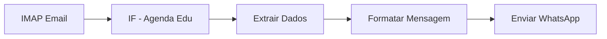

# 🤖 Workflow Agenda Edu - Encaminhamento WhatsApp

Sistema automatizado para encaminhar comunicados da Agenda Edu para o WhatsApp, extraindo informações específicas dos e-mails recebidos.

## 📋 Visão Geral

Este projeto implementa um workflow n8n que:

1. **Captura e-mails** automaticamente via IMAP
2. **Filtra** apenas e-mails da Agenda Edu (`no-reply@agendaedu.com`)
3. **Extrai dados** específicos do HTML do e-mail:
   - Nome do aluno
   - Conteúdo da atividade
   - Links dos anexos
4. **Formata** a mensagem para WhatsApp
5. **Envia** para números configurados

## 🚀 Instalação Rápida

```bash
# 1. Executar script de instalação
./install-agenda-edu-workflow.sh

# 2. Configurar credenciais no n8n
# 3. Importar workflow: agenda-edu-whatsapp-workflow.json
# 4. Ativar o workflow
```

## 📁 Arquivos do Projeto

| Arquivo | Descrição |
|---------|-----------|
| `agenda-edu-whatsapp-workflow.json` | Workflow n8n principal |
| `AGENDA_EDU_WHATSAPP_SETUP.md` | Documentação detalhada |
| `agenda-edu-config.json` | Configurações personalizáveis |
| `test-agenda-edu-workflow.js` | Script de teste |
| `install-agenda-edu-workflow.sh` | Script de instalação |

## 🔧 Configuração

### 1. Credenciais IMAP

Configure seu provedor de e-mail:

```json
{
  "host": "imap.gmail.com",
  "port": 993,
  "secure": true,
  "user": "seu-email@gmail.com",
  "password": "sua-senha-de-aplicativo"
}
```

### 2. Credenciais WhatsApp Business API

```json
{
  "accessToken": "seu-token-de-acesso",
  "phoneNumberId": "seu-phone-number-id",
  "businessAccountId": "seu-business-account-id"
}
```

### 3. Números de Destino

Edite no arquivo de configuração ou no nó "Formatar Mensagem":

```javascript
const numerosTelefone = [
  '+5521996496442',  // Substitua pelos seus números
  '+5521966719259'
];
```

## 🧪 Teste

```bash
# Executar teste completo
node test-agenda-edu-workflow.js

# Saída esperada:
# ✅ Filtro IF: PASSOU
# ✅ Extração de dados: PASSOU  
# ✅ Formatação: PASSOU
# ✅ Links extraídos: 2 encontrados
```

## 📱 Exemplo de Mensagem Gerada

```
*Novo Comunicado da Agenda Edu*

*Aluno(a):*
OLIVIA DUARTE LACERDA

*Atividade:*
História - Paula Castellano
Disciplina: História
Data de entrega: Entregar em sala de aula
Descrição: Material da semana - slides Império Romano
Lição de Casa: Império...o Romano.pdf Império...o Romano.pptx

*Links para Anexos:*
• http://link.agendaedu.com/arquivo1.pdf
• http://link.agendaedu.com/arquivo2.pptx
```

## 🔍 Funcionamento Técnico

### Fluxo do Workflow



### Extração de Dados

1. **Nome do Aluno**: Regex `Confira a Agenda de\s+([^\s]+(?:\s+[^\s]+)*?)\s+e continue acompanhando`
2. **Conteúdo**: Regex `certo\?([\s\S]*?)Confirmar Leitura`
3. **Links**: Regex `<a[^>]+href="([^"]+)"[^>]*>([^<]+)</a>`

### Limpeza de HTML

- Remove tags HTML
- Decodifica entidades HTML
- Remove espaços múltiplos
- Formata texto limpo

## 🛠️ Personalização

### Alterar Padrões de Extração

Edite o nó "Extrair Dados do E-mail" e modifique as expressões regulares:

```javascript
// Exemplo: alterar padrão do nome do aluno
const nomeAlunoMatch = emailContent.match(/Novo padrão aqui/);
```

### Modificar Formato da Mensagem

Edite o nó "Formatar Mensagem":

```javascript
const mensagem = `*Seu Título Personalizado*

*Aluno(a):*
${nomeAluno}

*Atividade:*
${conteudoPrincipal}

*Links para Anexos:*
${linksFormatados}`;
```

### Adicionar Novos Números

```javascript
const numerosTelefone = [
  '+5521996496442',
  '+5521966719259',
  '+5521987654321'  // Novo número
];
```

## 🐛 Troubleshooting

### E-mails não são capturados
- ✅ Verificar credenciais IMAP
- ✅ Confirmar filtro `fromEmail`
- ✅ Verificar se e-mail está sendo recebido

### Dados não extraídos
- ✅ Verificar formato do e-mail da Agenda Edu
- ✅ Ajustar expressões regulares
- ✅ Testar com e-mail de exemplo

### WhatsApp não envia
- ✅ Verificar credenciais WhatsApp Business API
- ✅ Confirmar formato dos números (+55...)
- ✅ Verificar se número está verificado

## 📊 Monitoramento

- Acesse "Executions" no n8n
- Verifique logs de cada nó
- Use modo "Test" para debugar

## 🔒 Segurança

- Mantenha credenciais seguras
- Use senhas de aplicativo
- Monitore logs de acesso
- Considere webhooks para produção

## 📚 Documentação Adicional

- [AGENDA_EDU_WHATSAPP_SETUP.md](AGENDA_EDU_WHATSAPP_SETUP.md) - Documentação completa
- [agenda-edu-config.json](agenda-edu-config.json) - Configurações
- [test-agenda-edu-workflow.js](test-agenda-edu-workflow.js) - Script de teste

## 🆘 Suporte

Para problemas:
1. Verifique logs de execução no n8n
2. Execute o script de teste
3. Verifique credenciais
4. Confirme formato dos e-mails

## 📄 Licença

MIT License - Veja [LICENSE](LICENSE) para detalhes.

---

**Desenvolvido com ❤️ para automatizar a comunicação escolar**