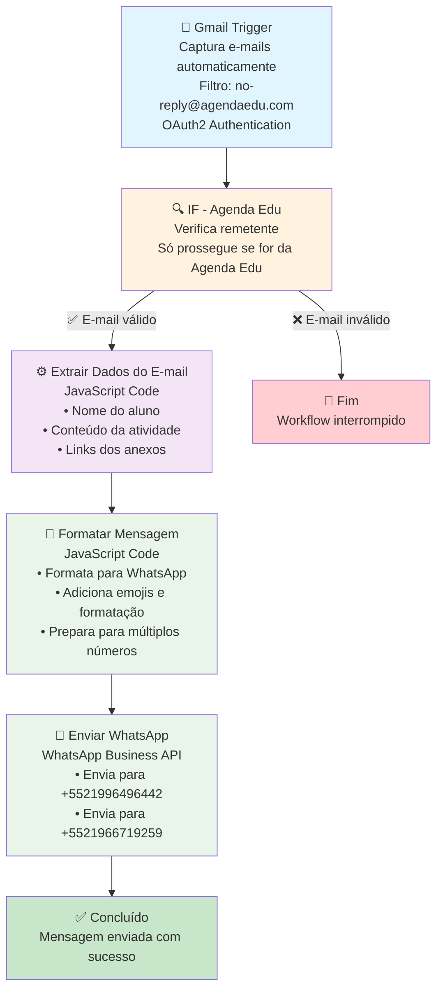
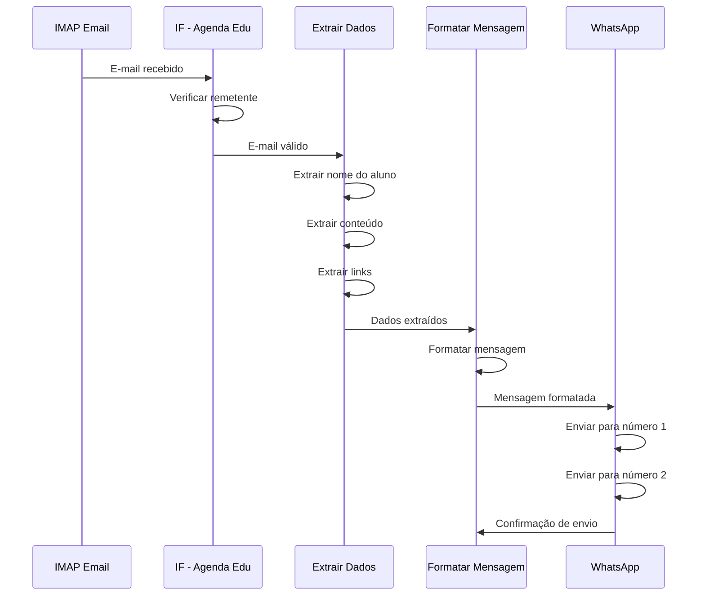

# Diagrama do Workflow Agenda Edu - WhatsApp

## Fluxo Principal



## Detalhamento dos Nós

### 1. Gmail Trigger (Trigger)
- **Função**: Captura e-mails automaticamente do Gmail
- **Frequência**: A cada minuto
- **Filtro**: Apenas `no-reply@agendaedu.com`
- **Configuração**: Credenciais Gmail OAuth2 necessárias
- **Vantagem**: Mais seguro que IMAP, tokens automáticos

### 2. IF - Agenda Edu (Filtro)
- **Função**: Verifica se o e-mail é da Agenda Edu
- **Condição**: Campo "from" contém `no-reply@agendaedu.com`
- **Resultado**: Prossegue apenas se verdadeiro

### 3. Extrair Dados do E-mail (Processamento)
- **Função**: Extrai informações específicas do HTML
- **Tecnologia**: JavaScript com regex
- **Dados extraídos**:
  - Nome do aluno (entre "Confira a Agenda de" e "e continue acompanhando")
  - Conteúdo da atividade (entre "certo?" e "Confirmar Leitura")
  - Links dos anexos (tags `<a>` com extensões de arquivo)

### 4. Formatar Mensagem (Transformação)
- **Função**: Formata dados para WhatsApp
- **Tecnologia**: JavaScript
- **Formatação**:
  - Título em negrito
  - Seções organizadas
  - Links dos anexos em lista
  - Preparação para múltiplos números

### 5. Enviar WhatsApp (Ação)
- **Função**: Envia mensagem via WhatsApp Business API
- **Destinos**: Números configurados
- **Configuração**: Credenciais WhatsApp Business API

## Fluxo de Dados



## Configurações Necessárias

### Credenciais Gmail OAuth2
```json
{
  "clientId": "seu-client-id.apps.googleusercontent.com",
  "clientSecret": "seu-client-secret",
  "accessToken": "seu-access-token",
  "refreshToken": "seu-refresh-token"
}
```

### Credenciais WhatsApp
```json
{
  "accessToken": "seu-token-de-acesso",
  "phoneNumberId": "seu-phone-number-id",
  "businessAccountId": "seu-business-account-id"
}
```

### Números de Destino
```javascript
const numerosTelefone = [
  '+5521996496442',
  '+5521966719259'
];
```

## Tratamento de Erros

- **E-mail inválido**: Workflow interrompido no nó IF
- **Dados não extraídos**: Valores padrão ("Nome não encontrado", etc.)
- **Falha no WhatsApp**: Log de erro, execução continua
- **Credenciais inválidas**: Falha na autenticação, workflow pausado

## Monitoramento

- **Logs**: Acessíveis via interface n8n
- **Execuções**: Histórico completo de execuções
- **Status**: Indicadores visuais de sucesso/falha
- **Métricas**: Tempo de execução, taxa de sucesso